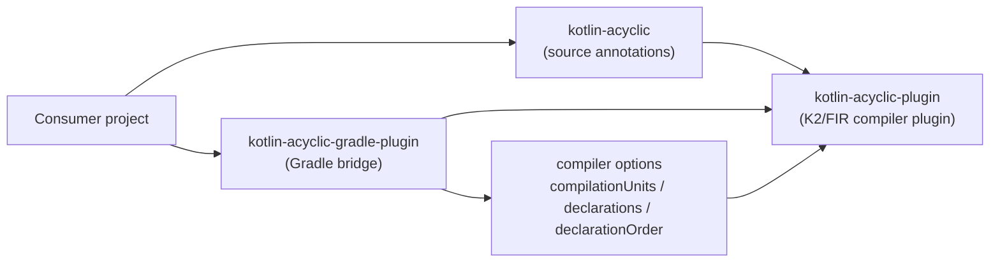
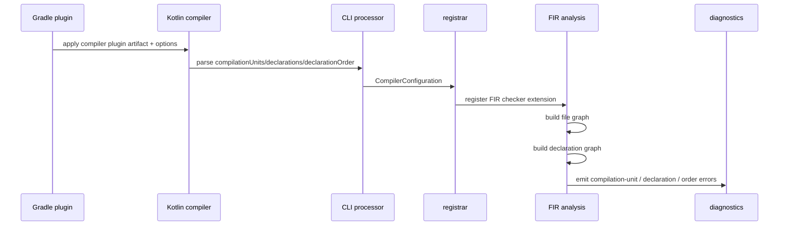
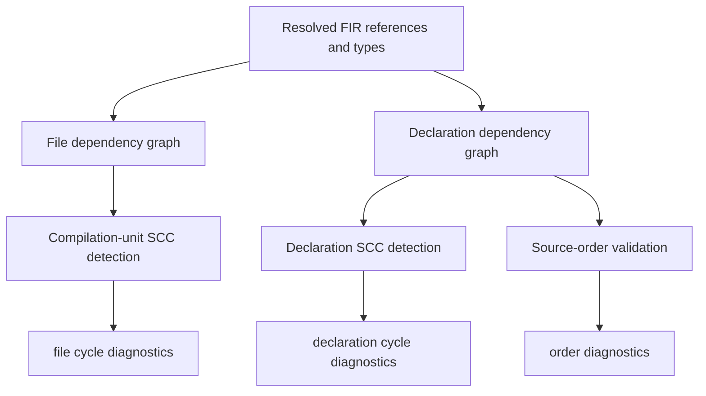
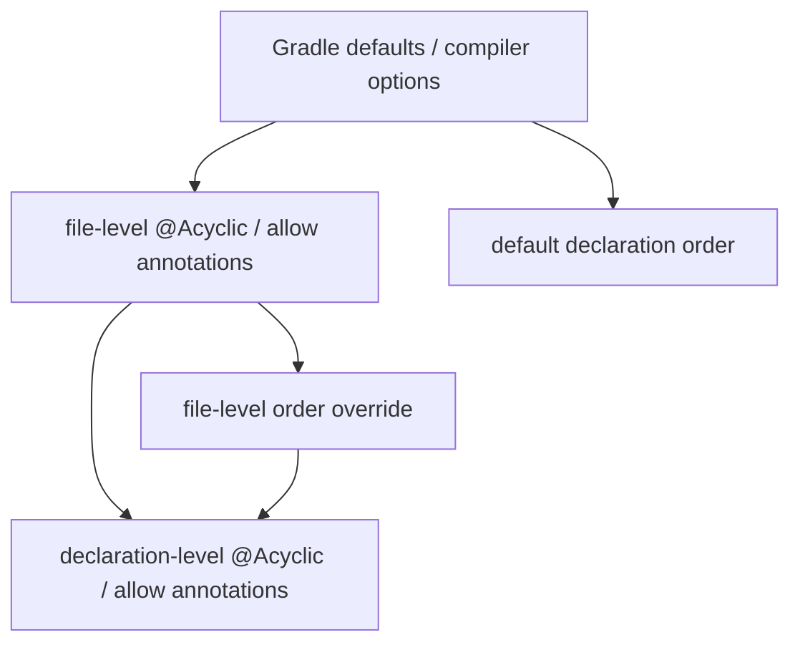

# Acyclic Walkthrough

This file is intended as a manual review guide for the whole `one.wabbit.acyclic` stack.

If you want the shortest useful review order, use this:

1. Review the annotation surface in `../kotlin-acyclic`.
2. Review the Gradle defaults and option mapping in `../kotlin-acyclic-gradle-plugin`.
3. Review compiler-plugin configuration entry points in this repository.
4. Review file-level analysis.
5. Review declaration-level analysis.
6. Review the tests last, using them as executable examples.

## Topology

## Suggested Review Order

### 1. Annotation Library

Start in `../library`.

Files:

- `../library/src/commonMain/kotlin/one/wabbit/acyclic/Acyclic.kt`
- `../library/src/commonMain/kotlin/one/wabbit/acyclic/AcyclicOrder.kt`
- `../library/src/commonMain/kotlin/one/wabbit/acyclic/AllowCompilationUnitCycles.kt`
- `../library/src/commonMain/kotlin/one/wabbit/acyclic/AllowSelfRecursion.kt`
- `../library/src/commonMain/kotlin/one/wabbit/acyclic/AllowMutualRecursion.kt`

Questions to answer:

- What is the public annotation vocabulary?
- Which annotations opt code in?
- Which annotations opt code out?
- Which annotations are file-only versus declaration-capable?

### 2. Gradle Bridge

Then review `../gradle-plugin`.

Files:

- `../gradle-plugin/src/main/kotlin/one/wabbit/acyclic/gradle/AcyclicGradleExtension.kt`
- `../gradle-plugin/src/main/kotlin/one/wabbit/acyclic/gradle/AcyclicGradlePlugin.kt`

Questions to answer:

- What are the module-level defaults?
- How do Gradle values map to compiler options?
- Is the compiler plugin artifact wiring correct?

### 3. Compiler Entry Points

Then review the entry points in this repository.

Files:

- `src/main/kotlin/one/wabbit/acyclic/AcyclicCommandLineProcessor.kt`
- `src/main/kotlin/one/wabbit/acyclic/AcyclicCompilerPluginRegistrar.kt`
- `src/main/kotlin/one/wabbit/acyclic/AcyclicConfiguration.kt`

Questions to answer:

- What options exist?
- How are defaults represented internally?
- Where does FIR registration happen?

## Compile-Time Flow

## Internal Model

The core mental model is two graphs built from resolved FIR dependencies.

## File-Level Analysis

Read:

- `src/main/kotlin/one/wabbit/acyclic/AcyclicControls.kt`
- `src/main/kotlin/one/wabbit/acyclic/AcyclicFileAnalysis.kt`
- `src/main/kotlin/one/wabbit/acyclic/AcyclicDependencyGraph.kt`

What to look for:

- how source annotations are read from resolved symbols
- how files are mapped from symbols back to their origin files
- how file opt-in and file opt-out interact
- how SCCs are turned into diagnostics

The key question here is: does the file graph represent semantic dependency rather than package or import trivia?

## Declaration-Level Analysis

Read:

- `src/main/kotlin/one/wabbit/acyclic/AcyclicFileAnalysis.kt`
- `src/main/kotlin/one/wabbit/acyclic/AcyclicDeclarationGraph.kt`

What to look for:

- which declaration kinds become graph nodes
- which references count as edges
- where lexical scoping is intentionally ignored
- how self recursion differs from mutual recursion
- how top-down and bottom-up order are computed

The key question here is: does the declaration graph capture recursive definition structure without confusing scoping for dependency?

Important current boundary:

- declaration analysis is file-local today
- declaration nodes are accumulated per file
- cross-file declaration edges are intentionally ignored by the declaration graph
- cross-file recursion is therefore enforced only by compilation-unit analysis, not by a module-wide declaration graph
- local declarations are not tracked as separate declaration nodes
- resolved dependencies that appear inside local declarations are attributed to the enclosing tracked declaration instead

## Control Precedence

Practical reading:

- build config chooses the default policy
- file annotations can opt whole files in or out and can override order
- declaration annotations can opt single declarations in or grant narrow exceptions
- `@Acyclic(order = DEFAULT)` resets one declaration back to the build-level order default

## Diagnostic Priority

Current reporting policy:

- declaration cycles are reported as the primary error for edges inside a cyclic SCC
- declaration-order diagnostics are still reported for non-cyclic wrong-direction edges
- redundant order diagnostics for edges already covered by a reported declaration cycle are suppressed

## Tests

Review these last:

- `src/test/kotlin/one/wabbit/acyclic/DependencyGraphTest.kt`
- `src/test/kotlin/one/wabbit/acyclic/DeclarationGraphTest.kt`
- `src/test/kotlin/one/wabbit/acyclic/CompilerIntegrationTest.kt`

Suggested reading order inside tests:

1. graph tests for basic SCC and order behavior
2. integration tests for scoping exemptions
3. integration tests for opt-in modes
4. integration tests for self recursion, mutual recursion, and file cycles
5. integration tests for top-down versus bottom-up order

## What To Validate Manually

- The public annotation vocabulary matches the intended policy.
- The Gradle defaults match the intended rollout strategy.
- CLI values and Gradle values are aligned.
- File-level checks really work across same-package files.
- Declaration-level checks really distinguish self recursion, mutual recursion, and order violations.
- Scoping-only patterns remain legal.
- The explicit escape hatches are narrow and require visible source annotations.
